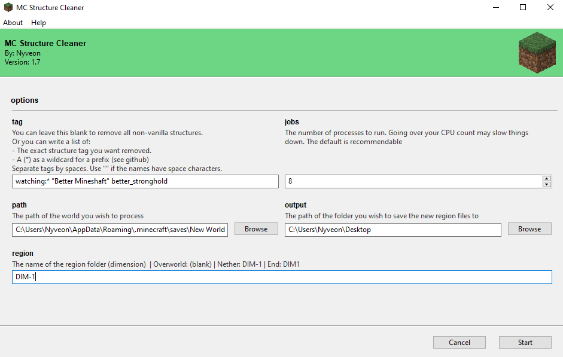

# MCStructureCleaner

Minecraft utility designed to repair worlds affected by the [[MC-194811] Missing structures will destroy saved worlds](https://bugs.mojang.com/browse/MC-194811) bug. This bug, resulting from uninstalling mods that generate custom structures, can cause **world instability** and **corrupt saves**. MCStructureCleaner meticulously scans and cleans every chunk in every region file of the world, removing orphaned `structure reference` and `structure start` tags. This process ensures clean error logs, efficient chunk saving and a more stable Minecraft experience.

## Key features

- Cleans up references to non-existent structures
- Fixes `Unknown structure start: <missing structure>` error.
- Fixes `Failed to save chunk` error.
- Fixes `Found reference to unknown structure` console spam.
- Should work on all Minecraft versions over 1.12

## Installation

**⚠ Important:** Always back up your world before using MCStructureCleaner's results

1. **Install [Python 3.x](https://www.python.org/)**. *Python 3.12.x recommended*.
2. **Install Dependencies:** Use the following commands in the command line to install required libraries:

```bash
pip install git+https://github.com/Nyveon/anvil-parser
pip install Gooey
```

3. **Download MCStructureCleaner:** Grab the latest release (_MCStructureCleaner_v17.zip_) from the [releases page](https://github.com/Nyveon/MCStructureCleaner/releases) and extract the contents.

## Usage

1. **Find the Structure Tags**: I recommend using something like [NBTExplorer](https://github.com/jaquadro/NBTExplorer) to identify the tags you wish to remove.
2. **Launch MCStructureCleaner**: Run `main.py` by double-clicking the file. You will be greeted with a user-friendly interface.


3. **Configure options**:
   - `tag`: Here you have two options,
      1. Leave the field blank if you want to delete all non-vanilla structure tags.
      2. Write a space-separated list of exact tags or tag prefixes you want removed.
         - You can use a _wildcard_ (*) to match prefixes. For example if you want to remove all structures from additional structures you would add `additionalstructures:*` to the list.
         - Note: Tag names are case sensitive.
         - Note: If the tag name has spaces, surround it with quotes. For example, `"my structure" "another structure"`
   - `jobs`: The number of threads you want to run it on. The default it optimal in most cases.
   - `path`: The path to the world folder. (The whole folder, not just the `region` folder)
   - `output`: The path to the output folder. This is where the cleaned `new_region` will be saved. If you leave this blank, the cleaned world will be saved in the same folder as MCStructureCleaner.
   - `region`: The dimension you want to clean. If you leave this **blank** it will clean the overworld. `DIM-1` is the nether, `DIM1` is the end.
4. **Example**: this input will delete all occurances of "Better Mineshaft" and better_stronghold, as well as all structures from the mod "watching" in the world "New World", in the Nether (DIM-1), using 8 threads. The world folder is located in the user's minecraft saves, and the output will be saved to the desktop.



5. **Start Cleaning:** Once configured, click `Start` to begin the process. This may take a while, especially if you have a larger world.
6. **Toubleshooting:** If there is an error, it will be displayed in the `Output` section. If there is no error, the program will say `Done!` and you can close the program.
7. **New files:** Now you may rename the output folder (called `new_region`) to `region` and **replace** the old `region` folder in your world. **Don't forget to backup your world first!**
8. Enjoy your now working world 😊

### Command Line

<details>
  <summary>Only recommended if the GUI does not work on your device</summary>

1. Run main.py with any of the following parameters. I recommend using [NBTExplorer](https://github.com/jaquadro/NBTExplorer) to find the name, or just letting the program fix all non-vanilla names by not inputting any tag.

   - `-h` For help on command line arguments.
   - `-t` For the tag(s) you want removed, in quotes. Space-separated if multiple. Leave empty if you wish to remove ALL NON-VANILLA TAGS. Use * as a wildcard after a prefix.
   - `-j` For the number of threads you want to run it on. Default: 2 x CPU logical processors.
   - `-w` For the name of the world you want to process. Default: "world".
   - `-p` For the path to the world you want to process. Default: current directory.
   - `-r` For the name of the sub-folder (dimension) in the world. Default: "".
   - `-o` For the path of the folder where the new region folder will be saved to. Default: current directory.
   - **Example 1:** This command will delete all non-vanilla structures (defined up to 1.17) in the overworld of the world "SMP"

   ```bash
   python main.py -w "SMP"
   ```

   - **Example 2:** This command will delete all occurances of "Better Mineshaft" and of "Better Stronghold" in the world "MyWorld", in the Nether (DIM-1), using 8 threads. The world folder is located in the user's minecraft saves, and the output will be saved to the desktop.

   ```bash
   python main.py -t "Better Mineshaft" "Better Stronghold" -j 8 -r "DIM-1" -p "C:\Users\X\AppData\Roaming\.minecraft\saves\MyWorld" -o "C:\Users\X\Desktop"
   ```

   If you are on windows, I recommend using PowerShell.

2. Let it run. This may take a while, depending on the power of your computer and the size of your world.
3. Replace the contents of your region folder with the contents of new_region.
4. Enjoy your now working world 😊

</details>

## Warnings

1. Always back up your worlds before making any changes to them.
2. Structure specific effects that remained after uninstalling the mod will no longer work for the removed structures. This includes locating structures and chests being populated by custom loot tables.
3. If you have corrupted region files the script may crash.

## Developers

### Installation & Testing

#### Getting Started

Clone the repository, then install requirements:

```bash
git clone https://github.com/Nyveon/MCStructureCleaner
cd MCStructureCleaner
pip install -r requirements.txt
pip install -r tests/requirements.txt
```

#### Linting and style

The project files are currently formatted with [Black](https://github.com/psf/black). If you send a pull request formatted with Black, most likely no style changes will be made to your code, but feel free to send anything as long as the code is readable and organized.

#### Running tests

- **VSCode**: the testing environment is already configured, simply press the `Run Tests` button added by the [official Python Extension](https://code.visualstudio.com/docs/python/testing).
- **Command Line**:

Without coverageL

```bash
pytest -v tests/
```

With coverage:

```bash
pytest -v --cov=. tests/ --cov-report xml:cov.xml
```

- **Expected coverage:** The `structurecleaner` folder should have 100% coverage.

#### Making your own tests

1. Generate your expected input files and output files. This can be done easily by running the program on a world, and then copying the region folder to the `tests` folder, and renaming it to `expected_input` and `expected_output` respectively. However, for new formats it is important to thoroughly check the output or make it by hand with NBTExplorer!
2. Place them in the directory `tests/data/X` where X is the name of the test. (See other tests for reference)
3. Use `remove_tags_test` in the `tests` directory to create your test. (See other tests for reference)
4. Run pytest. The coverage should be the same as before, and the test should pass.

#### Todo & Contribution

Contributions are always welcome! See the [issues page](https://github.com/Nyveon/MCStructureCleaner/issues) for ideas, or feel free to suggest your own ideas.

## Notes

- Feel free to message me on discord (@Nyveon) or twitter (Nyveon) if you need help using it.
- **Why did we make this?** To save our own SMP world after uninstalling some mods and getting the MC-194811 error. We had spent a lot of time on it, and didn't want anyone else to have to lose their world to the same bug.
- Thanks to @DemonInTheCloset for contributing to multiprocessing and command line arguments.
- Thanks to @lleheny0 for contributing to file validation.

### Versions tested

- 1.12 and earlier: The bug does not apply to these versions.
- 1.13.x: 🟡 Manually
- 1.14.x: 🟠 Untested, but should work.
- 1.15.x: 🟢 Automatically tested by the code.
- 1.16.x: 🟡 Manually tested.
- 1.17.x: 🟠 Untested, but should work
- 1.18.x: 🟡 Manually tested.
- 1.19.x: 🟠 Untested, but should work
- 1.20.x: 🟡 Manually tested.
- Later versions: 🟠 Untested.

If you use this for any version, please let me know that it worked so this section can be updated! You can contact me on discord or leave an [issue](https://github.com/Nyveon/MCStructureCleaner/issues).


